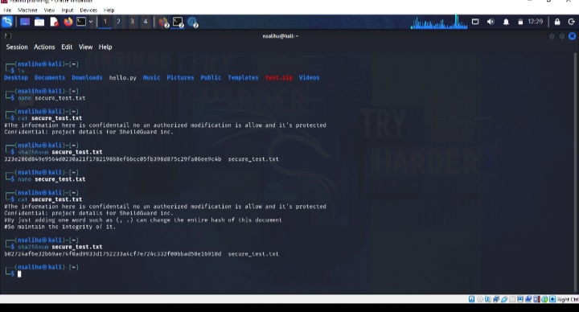
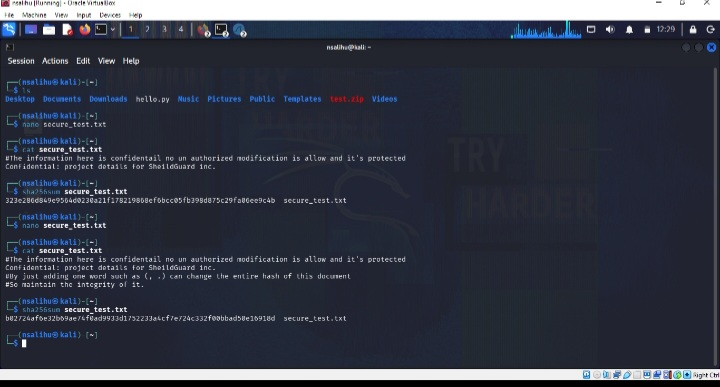
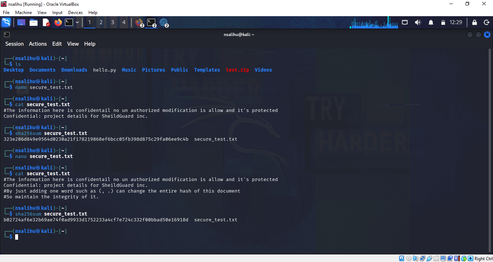

# sha256-file-integrity-verification

> Detecting unauthorized file modification using SHA-256 cryptographic hashing on Kali Linux.


---

# Project Overview

Maintaining data integrity is a fundamental requirement in cybersecurity. Organizations must ensure that sensitive files remain unchanged unless modifications are authorized. One of the most effective methods for verifying file integrity is the use of cryptographic hash functions.

This project demonstrates how the **SHA-256** hashing algorithm can detect unauthorized modifications to a file. A confidential test file was created, a baseline hash was generated, the file was intentionally modified, and a new hash was calculated. Comparing both hash values confirmed that even a minor change produces a completely different cryptographic fingerprint.

This technique is widely used in **digital forensics, incident response, malware analysis, secure software distribution, and file integrity monitoring (FIM)**.

---

# Objectives

- Create a confidential test file.
- Generate a baseline SHA-256 hash.
- Simulate unauthorized file modification.
- Generate a new SHA-256 hash after modification.
- Compare both hashes to verify file integrity.
- Demonstrate the effectiveness of cryptographic hashing for tamper detection.

---

# Tools & Technologies

| Category                | Technology                 |
|-------------------------|----------------------------|
| Operating System        | Kali Linux                 |
| Virtualization          | Oracle VirtualBox          |
| Shell                   | Bash                       |
| Utilities               | `sha256sum`, `nano`, `cat` |
| Cryptographic Algorithm | SHA-256                    |

---

# Lab Environment

| Component          | Details              |
|--------------------|----------------------|
| Operating System   | Kali Linux           |
| Platform           | Oracle VirtualBox    |
| Shell              | Bash                 |
| Hash Algorithm     | SHA-256              |
| Command-Line Tools | nano, sha256sum, cat |

---

# Implementation

## Step 1 — Create the Test File

A file named **secure_test.txt** was created using the Linux **nano** editor. The file contained sample confidential information representing sensitive organizational data.

```bash
nano secure_test.txt
cat secure_test.txt
```

### Screenshot



---

## Step 2 — Generate the Baseline Hash

The SHA-256 hash of the original file was generated to establish a trusted baseline for future integrity verification.

```bash
sha256sum secure_test.txt
```

Output

```text
323e286d849e9564d0230a21f178219868ef6bcc05fb398d875c29fa06ee9c4b
```
### Screenshot


---

## Step 3 — Simulate File Modification

The file was intentionally modified by adding additional content to simulate unauthorized tampering.

```bash
nano secure_test.txt
```

### Screenshot



---

## Step 4 — Verify File Integrity

After modification, the SHA-256 hash was generated again.

```bash
sha256sum secure_test.txt
```

Output

```text
b02724af6e32b69ae74f0ad9933d1752233a4cf7e724c332f00bbad50e16918d
```

The new hash differed completely from the original baseline, confirming that the file had been altered.

### Screenshot



---

# Results

| File State    | SHA-256 Hash           | Integrity Status      |
|---------------|------------------------|-----------------------|
| Original File | `323e286d...a06ee9c4b` | Verified              |
| Modified File | `b02724af...e16918d`   | Integrity Compromised |

### Key Observation

Although only a small change was made to the file, the resulting SHA-256 hash changed completely. This demonstrates the **Avalanche Effect**, where even a minor modification produces a significantly different hash value.

---

# Key Concepts Demonstrated

- Cryptographic Hash Functions
- SHA-256 Hashing
- Data Integrity Verification
- File Integrity Monitoring (FIM)
- Tamper Detection
- Baseline Hash Comparison
- Avalanche Effect
- Linux Command-Line Operations

---

# Skills Demonstrated

- Linux Administration
- Bash Command-Line Usage
- Cryptographic Hash Analysis
- File Integrity Verification
- Security Documentation
- Technical Reporting
- Digital Forensics Fundamentals

---

# Real-World Applications

The techniques demonstrated in this project are commonly used in:

- File Integrity Monitoring (Tripwire, Wazuh, OSSEC)
- Digital Forensics Investigations
- Incident Response
- Malware Analysis
- Secure Software Distribution
- Security Compliance Audits
- Evidence Verification
- Backup Validation

---

# Repository Structure

```text
sha256-file-integrity-verification/
│
├── README.md
├── LICENSE
│
└── screenshots/
    ├── file_creation.png
    ├── baseline_hash.png
    ├── file_modification.png
    └── hash_comparison.png
```

---

# Lessons Learned

This project strengthened my understanding of cryptographic hashing and demonstrated how organizations verify data integrity using SHA-256. It also reinforced the importance of baseline comparisons in detecting unauthorized modifications and highlighted the role of hashing in forensic investigations, malware analysis, and secure software distribution.

---

# Future Improvements

- Automate integrity verification using Bash scripting.
- Monitor multiple files simultaneously.
- Generate automated integrity reports.
- Compare additional hashing algorithms such as SHA-1 and SHA-512.
- Integrate with File Integrity Monitoring (FIM) solutions such as Wazuh or Tripwire.

---

# References

- NIST FIPS 180-4 – Secure Hash Standard (SHS)
- Kali Linux Documentation
- GNU Coreutils Documentation (`sha256sum`)

---

# Author

**Nuhu Salihu**

Cybersecurity Student | Aspiring Cybersecurity Analyst | Network Security Enthusiast

---

**If you found this project interesting, feel free to explore my other cybersecurity projects and labs.**
